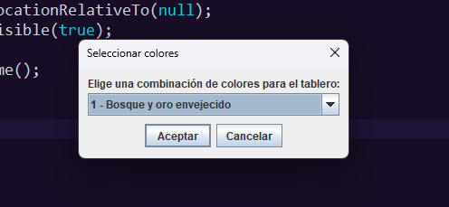
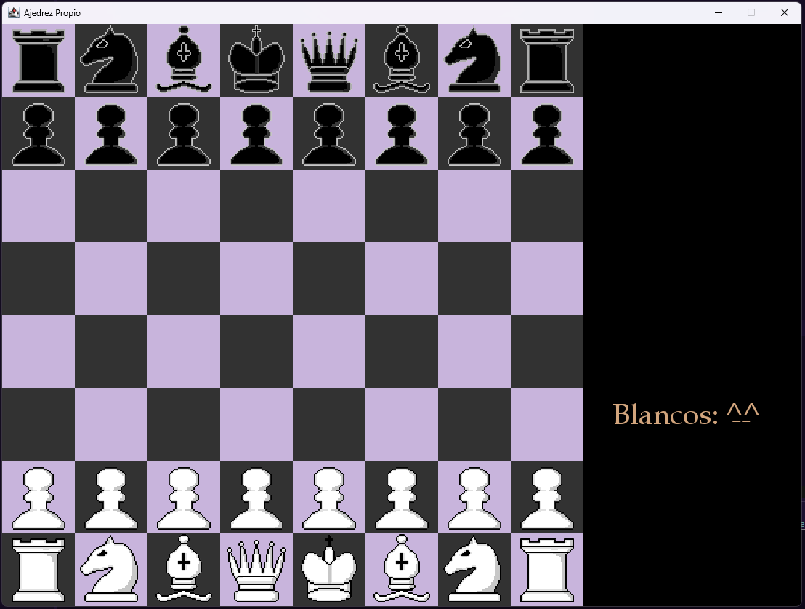
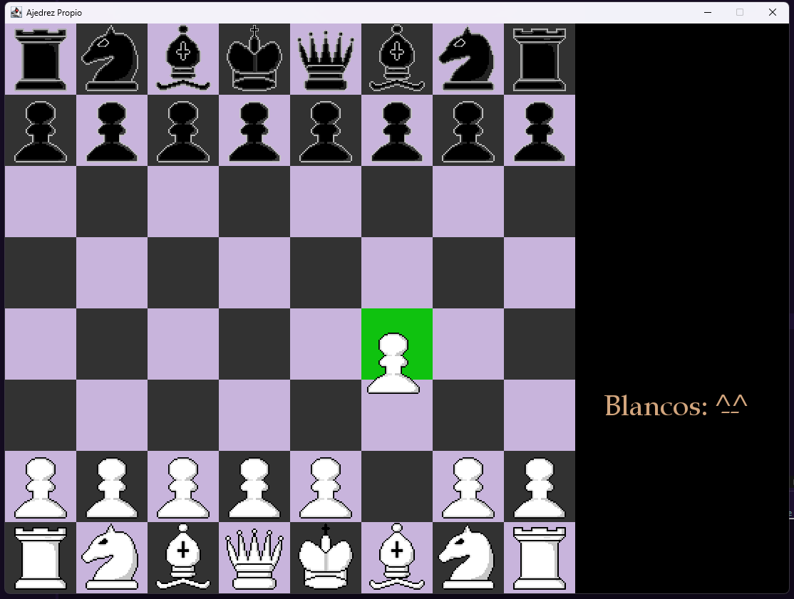
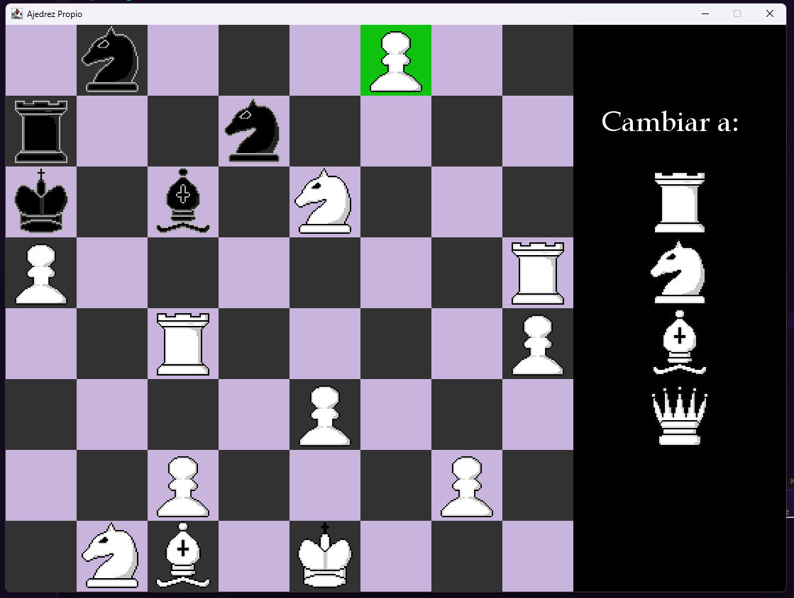
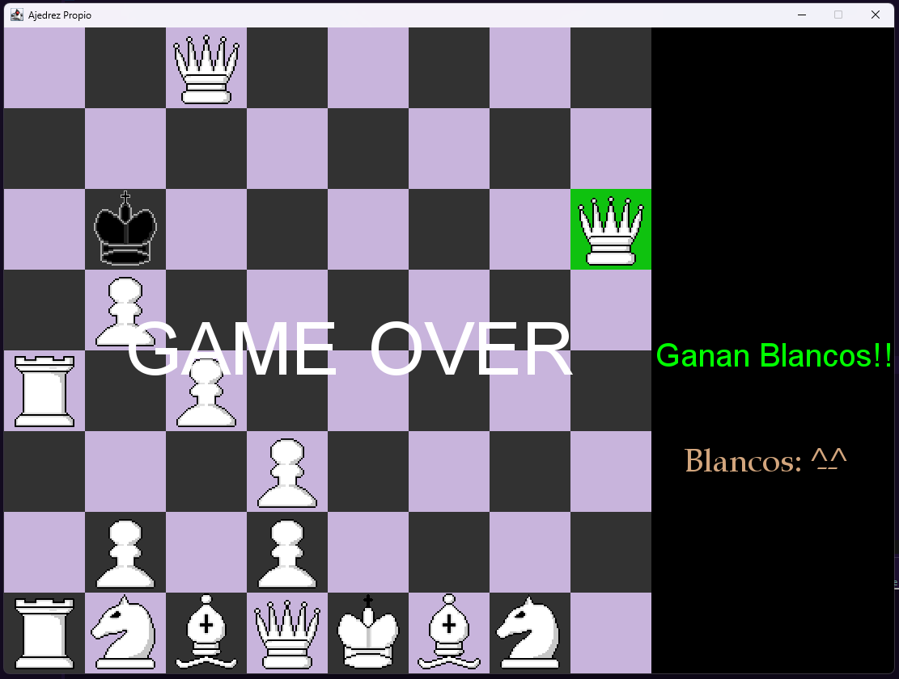
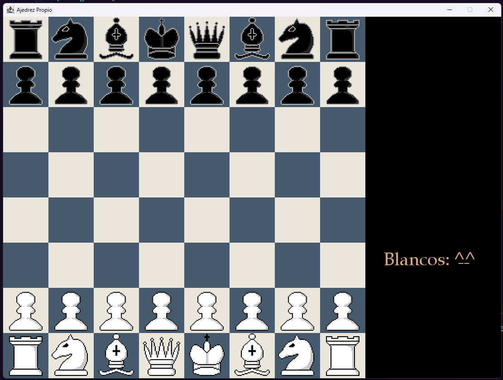

# ♟️ Ajedrez en Java con Interfaz Gráfica

> Un elegante y completo juego de ajedrez hecho en Java con interfaz gráfica. Ideal para jugar contra otro jugador humano en el mismo equipo. ¡Diseño atractivo, experiencia fluida y completamente funcional!
## 📖 Tabla de Contenidos
- [Características](#-características)
- [Instalación](#-instalación)
- [Uso](#-uso)
- [Capturas](#-capturas)
- [Tecnologías](#-tecnologías)
- [Estructura del proyecto](#-estructura)
- [Licencia](#-licencia)

## 🧩 Características

✅ Interfaz gráfica amigable con Swing  
✅ Movimiento legal de piezas implementado  
✅ Detección de jaque y jaque mate  
✅ Soporte para coronación de peones  
✅ Tablero interactivo (click en piezas y casillas)  
✅ Colores personalizables  
✅ Reinicio de partida con un solo clic  

---
## 🚀 Instalación

### 1. Clona el repositorio

```bash
git clone https://github.com/tuusuario/ajedrez-java-gui.git
cd ajedrez-java-gui
2. Compila el código
javac src/*.java
3. Ejecuta el programa
java -cp src Main
📦 También puedes importar el proyecto directamente en Eclipse, IntelliJ IDEA o tu IDE favorito.
```
---
## 🚀 Uso
```bash
- Abre tu IDE de preferencia
- Importa el proyecto dentro del IDE
- Ejecuta el Main
- Selecciona una opcion de colores de tablero
- Juega y diviertete
```
## 🖥️ Capturas de pantalla
### Seleccion de los colores del Tablero

### Tablero Seleccionado

### Movimiento de las piezas

### Seleccion de la ficha (cuando el peon llega a la otra parte)

### Game Over Screen

### Otro Tablero


## 🛠️ Tecnologías utilizadas

- Java 8+  
- Swing (javax.swing)  
- POO (Programación Orientada a Objetos)

## 💡 Estructura del proyecto
```bash
Ajedrez-Master/
│
├── src/
│   └── Main/
|   |       ├── Board.java
│   |       ├── GamePanel.java
│   |       ├── Main.java
│   |       ├── Rey.java
│   |       ├── Mouse.java
|   |       └── Type.java
|   └── Piece/
│          ├── Bishop.java
│          ├── King.java
│          ├── Knight.java
│          ├── Pawn.java
│          ├── Piece.java
│          ├── Queen.java
|          └── Rook.java
|    
│
├── res/
│   └── piece/
│          └── /*Todas las imagenes de cada pieza, blanco y negro*/
│
└── README.md
```
## 📜 Licencia


MIT License
Copyright (c) 2025 Adri-Coding-Dev
